# Artemis Global Tracker: Hardware Overview

The Artemis Global Tracker is an open source satellite tracker utilising the [SparkFun Artemis module](https://www.sparkfun.com/products/15484),
[Iridium 9603N satellite transceiver](https://www.iridium.com/products/iridium-9603/) and [u-blox ZOE-M8Q GNSS
](https://www.u-blox.com/en/product/zoe-m8-series).

The hardware design is based extensively on the:
- [SparkFun Artemis module](https://www.sparkfun.com/products/15484)
- [SparkFun Thing Plus - Artemis](https://www.sparkfun.com/products/15574) battery charging circuit and USB-C interface
- [SparkFun Qwiic Iridium 9603N](https://www.sparkfun.com/products/16394) Iridium 9603N, LTC3225 supercapacitor charger and ADM4210 inrush current circuit
- [SparkFun GPS Breakout - ZOE-M8Q](https://www.sparkfun.com/products/15193) ZOE connections and backup battery circuit

The design also makes use of the:
- [Skyworks AS179-92LF GaAs RF Switch](https://www.skyworksinc.com/products/switches/as179-92lf)
- [Maxtena M1600HCT-P-SMA antenna](https://www.maxtena.com/products/f-gps/m1600hct-p-sma/) which is tuned for Iridium, GPS and GLONASS
  - [Available from SparkFun](https://www.sparkfun.com/products/16838)
- [TE / MEAS Switzerland MS8607](https://www.te.com/usa-en/product-CAT-BLPS0018.html) combined pressure, humidity and temperature sensor

The full schematic for the tracker can be found [here](../../Hardware/Schematic.pdf)

Additional information can be found in the [FAQs](../GlobalTracker_FAQs/README.md)

## The Artemis Module

The heart of the tracker is, of course, the most excellent Artemis module from SparkFun. The pad allocation is defined [here](../Hardware_Overview/ARTEMIS_PINS.md).

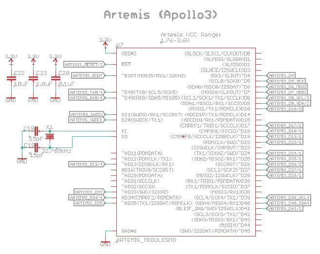

## Power Options

The tracker can be powered from:
- the USB-C interface
- a LiPo battery (recharged via the USB-C interface)
- an external solar panel or battery pack (6V maximum)

3 x Energizer&trade; Ultimate Lithium AA or AAA cells are recommended as they will work down to -40C

Low-forward-voltage diodes isolate the power sources from each other. You can have the USB, LiPo and external cells connected simultaneously, it will do no harm.
The tracker will preferentially draw power from USB if it is connected.

If the USB is disconnected, the tracker will preferentially draw power from the external cells. If you have the external cells connected, you may as well disconnect the LiPo.

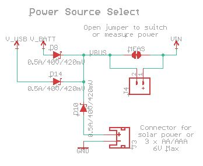

J4 (VBUS -> VIN) can be used to measure the current draw or to connect a power switch after you open the MEAS split pad.

## USB Interface

The USB interface is taken directly from the [SparkFun Thing Plus - Artemis](https://www.sparkfun.com/products/15574).

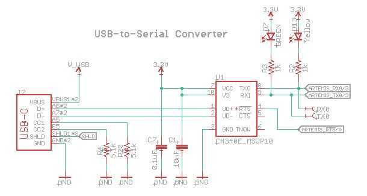

## LiPo Charger

The LiPo charger circuit is taken directly from the [SparkFun Thing Plus - Artemis](https://www.sparkfun.com/products/15574).

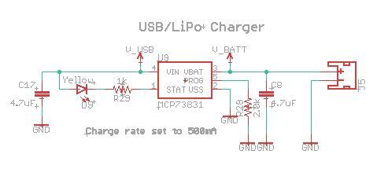

## 3.3V Regulator

3.3V power for the tracker is regulated by an AP2112K regulator. Its 50uA quiescent current draw means it can be powered continuously without
depleting the batteries during sleep.

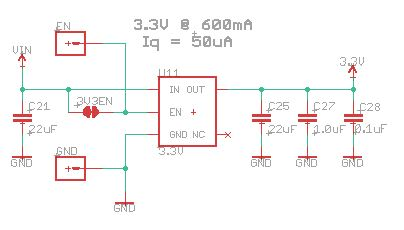

If you want to completely disable the regulator to minimise the current draw, you can do so by opening the 3.3V_EN split pad. The EN pin can then be used to enable/disable the regulator.
Pull EN low to disable the regulator, pull it up to VIN to enable it. EN could also be driven by a logic signal from an external timer circuit.

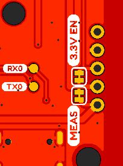

## ZOE-M8Q

GNSS data is provided by the u-blox ZOE-M8Q as used on the [SparkFun GPS Breakout - ZOE-M8Q](https://www.sparkfun.com/products/15193).

Connection to the Artemis is via I2C port 1. The serial and safeboot pins are available on test pads to allow the ZOE firmware to be updated.

Geofence alerts from the ZOE can be produced on PIO14, which is connected to Artemis pin D10.

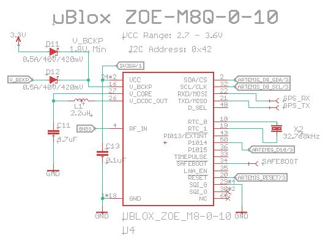

Back-up power for the ZOE is drawn preferentially from the 3.3V rail, but there is a small back-up battery too to keep the ZOE's clock running
when all other power sources have been disconnected. The battery recharges only when USB power is connected (to help minimise the 3.3V current
draw during sleep).

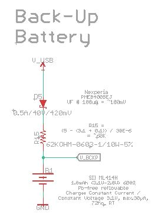

3.3V power for the ZOE is switched via a FET. The same switched power also feeds the antenna switch when the GNSS is in use.

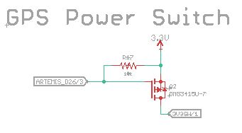

## Iridium 9603N

The tracker uses the same Iridium 9603N transceiver as the [SparkFun Qwiic Iridium 9603N](https://www.sparkfun.com/products/16394).

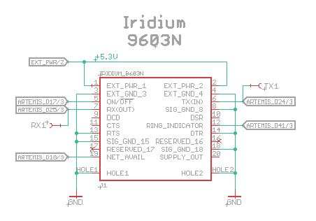

Power for the 9603N is provided by the same LTC3225 supercapacitor charger and ADM4210 in-rush current limit circuit as used by the Qwiic Iridium.

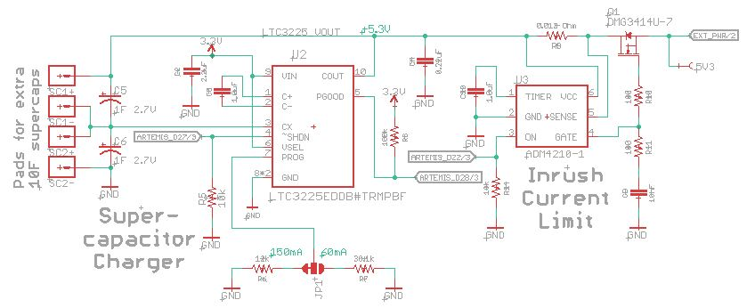

The LTC3225 charge current is adjustable up to a maximum of 150mA. When set to the full 150mA, the LTC3225 can match the 145mA average current
drawn by the 9603N during transmit. This means that 1 Farad supercapacitors are adequate as they only need to hold enough charge to meet the
9603N's 1.3A peak current draw during the very brief (8.3ms) transmit bursts.

If you want to power the Global Tracker from a low current source, e.g. solar panels, the charge current can be reduced to 60mA by
changing the **Charge Current** jumper link. The 60mA charge current is enough to offset the 9603N's 39mA average current draw during receive,
but bigger supercapacitors are needed to deliver the average current draw during a complete receive/transmit cycle.
So, if you do change the charge current to 60mA, you will also need to solder additional 10 Farad supercapacitors on to
the rear of the PCB using the solder pads provided.

## Antenna Switch

The ZOE and Iridium 9603N share the antenna via a [Skyworks AS179-92LF GaAs RF Switch](https://www.skyworksinc.com/products/switches/as179-92lf).

Care needs to be taken that the 3.3V GNSS and 5.3V 9603N are not powered up simultaneously as _bad things might happen to the AS179_.

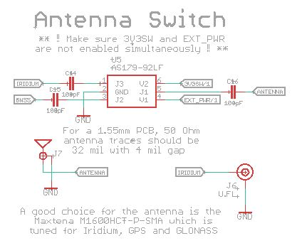

## Pressure, Humidity and Temperature Sensor

Pressure, humidity and temperature readings are provided by a [TE / MEAS Switzerland MS8607](https://www.te.com/usa-en/product-CAT-BLPS0018.html) combined sensor.
The MS8607 shares I2C port 1 with the ZOE.

The sensor will provide pressure readings as low as 10mbar which is equivalent to an altitude of approximately 31,000m.

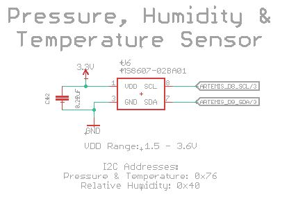

## I/O Pins

The Artemis' SPI and I2C (port 1) pins are broken out on pin headers so the user can connect external peripherals.

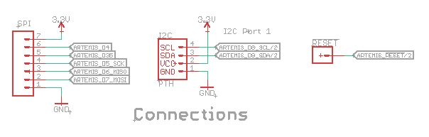

I2C port 4 is broken out on a standard SparkFun Qwiic connector.

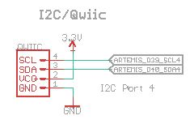

## Bus Voltage

The bus voltage (from the USB, LiPo or external cells) can be measured via the Artemis pin AD13. A simple two resistor divider divides the bus voltage by three.
Power to the resistor divider is switched by an N-FET so the power draw can be minimised during sleep.

