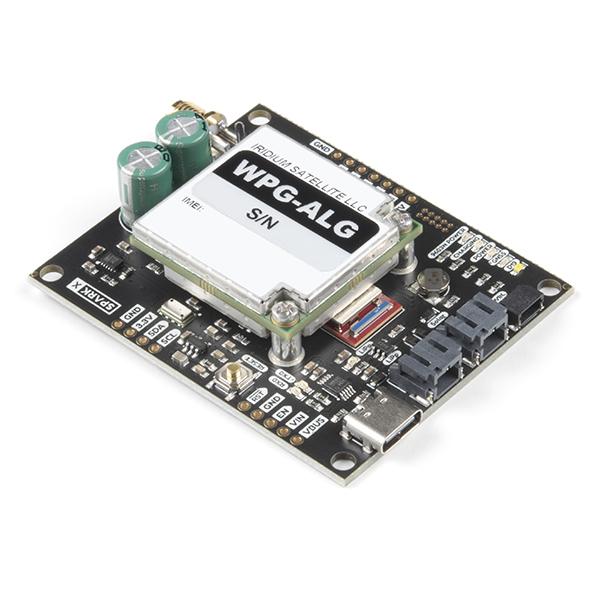
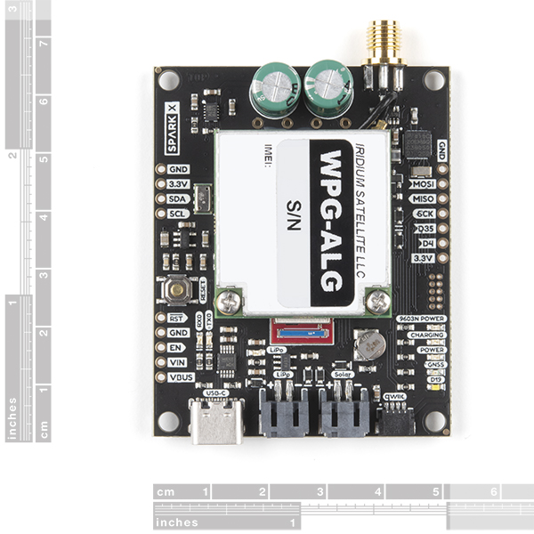

# Artemis Global Tracker

An open source global satellite tracker utilising the [SparkFun Artemis module](https://www.sparkfun.com/products/15484),
[Iridium 9603N satellite transceiver](https://www.iridium.com/products/iridium-9603/) and [u-blox ZOE-M8Q GNSS](https://www.u-blox.com/en/product/zoe-m8-series).

[*SparkX Artemis Global Tracker (SPX-16469)*](https://www.sparkfun.com/products/16469)

[*SparkX Artemis Global Tracker (SPX-16469)*](https://www.sparkfun.com/products/16469)

## Retired Product

The SparkX Artemis Global Tracker (SPX-16469) has been replaced by the [SparkFun Artemis Global Tracker (WRL-18712)](https://www.sparkfun.com/products/18712).

## Repository Contents

- **/Documentation** - Documentation for the hardware and the full GlobalTracker example
- **/Hardware** - Eagle PCB, SCH and LBR design files
- **/Software** - Arduino examples
- **/Tools** - Tools to help: configure the full GlobalTracker example via USB or remotely via Iridium messaging; and track and map its position
- **/binaries** - binary files for the examples which you can upload using the [Artemis Firmware Upload GUI](https://github.com/sparkfun/Artemis-Firmware-Upload-GUI) instead of the Arduino IDE
- **LICENSE.md** contains the licence information

## Documentation

- [Hardware overview](Documentation/Hardware_Overview/README.md): an overview of the hardware
- The Artemis pin allocation is summarised [here](Documentation/Hardware_Overview/ARTEMIS_PINS.md)
- [Message Format](Documentation/Message_Format/README.md): a definition of the message format and fields (both binary and text) for the full GlobalTracker example
- [GlobalTracker FAQs](Documentation/GlobalTracker_FAQs/README.md): information to help you operate and configure the AGT

## License Information

This product is _**open source**_!

Please review the LICENSE.md file for license information.

If you have any questions or concerns on licensing, please contact technical support on our [SparkFun forums](https://forum.sparkfun.com/viewforum.php?f=123).

Distributed as-is; no warranty is given.

- Your friends at SparkFun.
