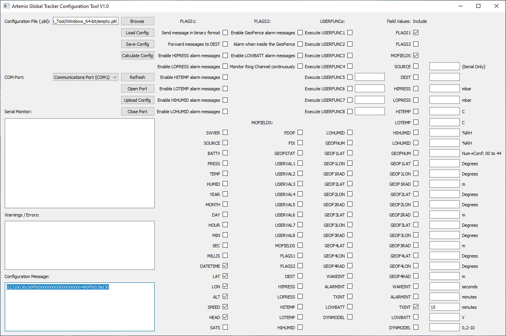
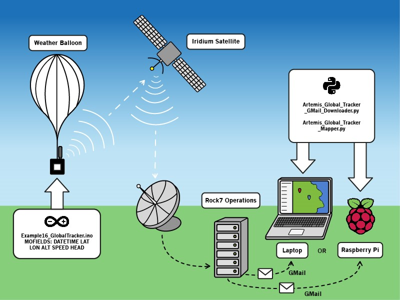
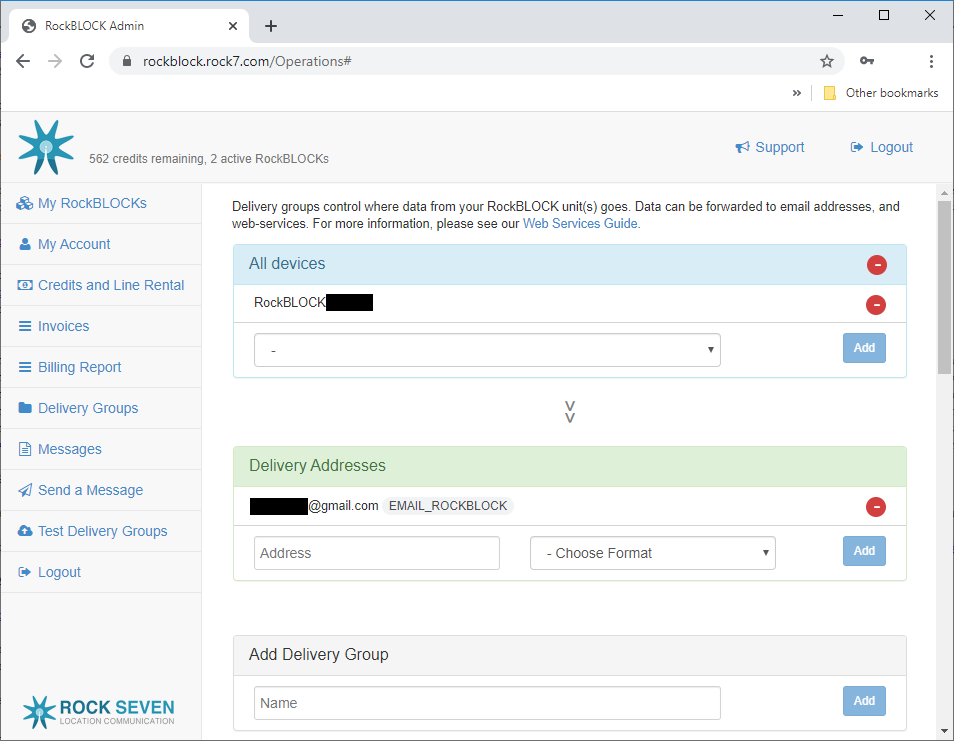
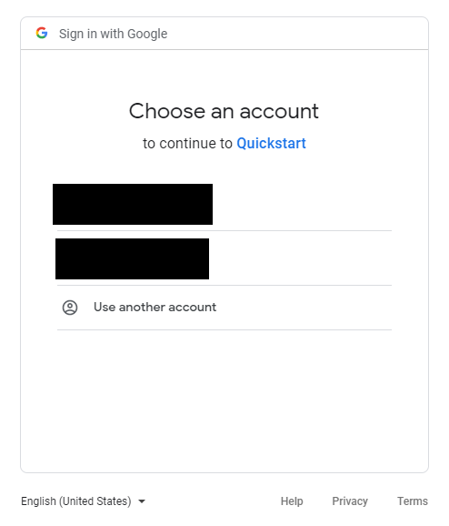
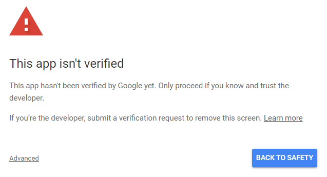
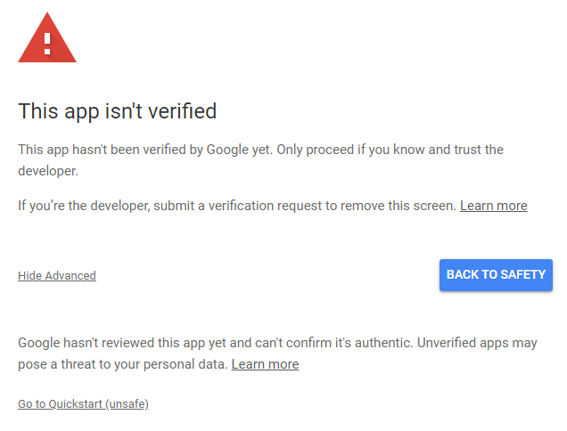
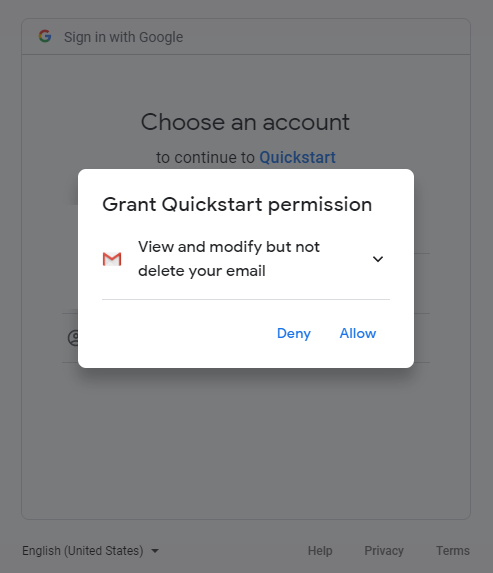
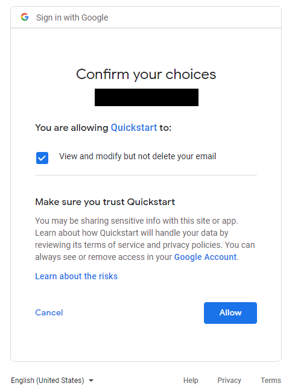
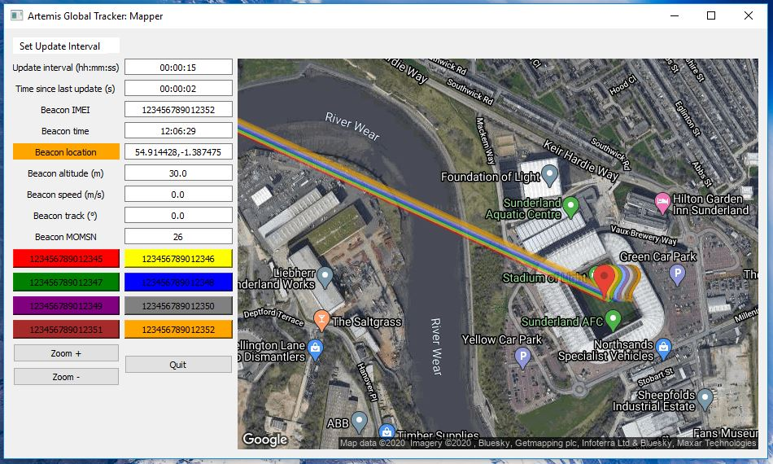
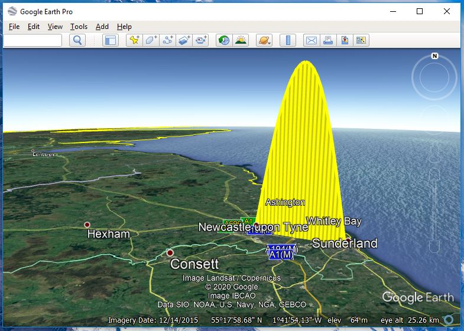

# Artemis Global Tracker: Tools

Tools to help: configure the full GlobalTracker example via USB or remotely via Iridium messaging; and track and map its position

## /Artemis_Global_Tracker_Configuration_Tool

A Python3 PyQt5 tool to configure the full GlobalTracker example via USB or remotely via Iridium messaging.



Please refer to the [GlobalTracker FAQs](../Documentation/GlobalTracker_FAQs/README.md) for full instructions.

### Quickstart:

First select the message fields (MOFIELDS) that you want the tracker to send. If you are going to use the Mapper (see below)
to track the tracker, you need to select **DATETIME**, **LAT**, **LON**, **ALT**, **SPEED** and **HEAD**. Tick the _Include_ checkbox for **MOFIELDS** too
otherwise the settings will not be updated. The Mapper expects text messages, while the Message Translator can translate binary messages.
Depending on which program you want to use, either tick the FLAGS1 _Send message in binary format_ box or ensure it is not ticked.
Tick the **FLAGS1** _Include_ checkbox too to make sure FLAGS1 is updated. Click _Calculate Config_ to generate the configuration message.

You can upload the configuration to a tracker locally by:
  - Connecting the tracker via a USB-C cable
  - Click the _Refresh_ button and select the COM port
  - Click _Open Port_ and you should see a welcome message from the tracker
  - Click _Upload Config_ to send the configuration message to the tracker
  - Check the _Serial Terminal_ to see if the configuration worked
  - Click _Close Port_ and then disconnect the tracker

You can update a tracker remotely by:
  - Right-clicking in the _Configuration Message_ window and select _Select All_
  - Right-click again and select _Copy_
  - Log in to [Rock7 Operations](https://rockblock.rock7.com/Operations)
  - Click on the _Send a Message_ tab
  - Select _Mode Hex_ and paste the configuration message into the _Hex String_ window
  - Tick the RockBLOCK serial number for the tracker(s) you want to update and click _Send Message_
  - The tracker settings will be updated and stored the next time the tracker sends a message

## /Artemis_Global_Tracker_Mapping_Tools

A set of Python tools which will allow you to: download messages from the tracker via a GMail account; stitch the messages together into a single .csv file;
convert the .csv file into .kml files for Google Earth; and display the real-time paths and locations of up to eight trackers using the Google Maps Static API.



The tools are:
- **Artemis_Global_Tracker_GMail_Downloader.py:** a Python3 tool which uses the GMail API to download messages from the tracker from your GMail account.
- **Artemis_Global_Tracker_Message_Translator.py:** a Python 3 tool to translate binary SBD messages. It can read messages from local files or an IMAP server and optionally create a GPX file from all read messages.
- **Artemis_Global_Tracker_Mapper.py:** a Python3 PyQt5 tool which will read the tracker messages downloaded by the Downloader and display the location and routes of up to eight trackers on Google Maps Static images.
- **Artemis_Global_Tracker_Stitcher.py:** this tool will stitch the individual tracker messages downloaded by the Downloader together into combined .csv files. Each tracker gets its own .csv file.
- **Artemis_Global_Tracker_CSV_DateTime.py:** this tool will convert the first column of the stitched .csv files from YYYYMMDDHHMMSS DateTime format into a more friendly DD/MM/YY,HH:MM:SS format.
- **Artemis_Global_Tracker_DateTime_CSV_to_KML.py:** this tool will convert the .csv files produced by the CSV_DateTime tool into .kml files that can be viewed in Google Earth. The path of the tracker can be shown as: a 2D (course over ground) or 3D (course and altitude) linestring; points (labelled with message sequence numbers); and arrows (indicating the heading of the tracker).
- **Flight_Simulator.py:** this tool generates simulated messages from up to eight virtual trackers. These messages can be used to test the other tools, including the Mapper.

### Artemis_Global_Tracker_GMail_Downloader.py:

Artemis_Global_Tracker_GMail_Downloader.py is a Python3 tool which uses the GMail API to download messages from the tracker from your GMail account.

Create yourself a GMail account. You can then add that email address to the _Delivery Group_ for your tracker in [Rock7 Operations](https://rockblock.rock7.com/Operations). Choose _EMAIL_ROCKBLOCK_ as the message format.



Log in to your GMail account in a web browser and create a 'label' (folder) called _SBD_. You can do this by: selecting an email in your inbox; then click on the _Move to_ icon
(the folder icon with the right arrow); select _Create new_; enter _SBD_ as the new label name; leave the Nest box empty; click _Create_. Your tracker messages will be automatically
moved to this label by the Downloader to avoid clogging up your inbox.

The Downloader requires access to your GMail credentials. Follow [these instructions](https://developers.google.com/gmail/api/quickstart/python)
to create your credentials and enable access for Python. After you have run the quickstart.py you will need to delete your token.pickle file as the
Downloader needs _modify_ permissions and quickstart.py only requests _readonly_ permissions. A new token.pickle will be created when you run the
Downloader.

You may see a warning message in your browser when you log in to authenticate the new token.pickle. This is normal. Follow the _Advanced_ link; then _Go to Quickstart (unsafe)_;
then click _Allow_; then click _Allow_ again. If the credentials were created successfully, you should see the message _The authentication flow has completed. You may close this window._







When you run the Downloader, it will automatically check your GMail inbox every 15 seconds for new tracker messages. When it finds one, it will download the SBD .bin attachment to to your computer,
mark the message as seen (read) and 'move' it to a folder called SBD by changing the message labels. This avoids clogging up your inbox. All of the messages are in SBD if you need to download the
attachments again.

### Artemis_Global_Tracker_Message_Translator.py:

A command-line script to translate binary SBD messages. Give the files to translate as argument, e.g. `*.bin`. To write coordinates into a GPX track, use the `-o` option combined with an output filename.
Example:
```
python3 Artemis_Global_Tracker_Message_Translator.py *.bin -o track.gpx
```

Alternatively, messages can be read from email attachments from an IMAP server with the `-i` option. In this case, give the name of an ini file with the server details as argument. The ini file should
look as follows:
```
[email]
host = imap.mymailserver.com
user = myusername
password = mypassword
from = 300123456789012@rockblock.rock7.com
```
Adjust the entries according to your configuration. The `from` entry filters messages according to sender and is handy to select messages from a specific device. Write just `@rockblock.rock7.com`
to process all messages from RockBLOCK. By default, the script only retrieves new messages. Use the `-a` option to retrieve all messages. Example for invoking the script:
```
python3 Artemis_Global_Tracker_Message_Translator.py -i imap_settings.ini -a -o track.gpx
```

### Artemis_Global_Tracker_Mapper.py:



Artemis_Global_Tracker_Mapper.py uses the Google Maps Static API to display the location and paths of up to eight trackers. The code will check
for the arrival of new .bin SBD messages, downloaded by the Downloader, every 15 seconds. When it finds one, it will display the location and path
of the tracker on a Google Maps Static API image.

If you are going to use the _Mapper_, run that first and tell it to ignore any existing .bin messages (if you want to).
Then start the _Downloader_. The downloader will download any new messages received by your GMail account from Rock7.
The Mapper will then pick them up and display your tracker's location.

You can find more details about the Maps Static API [here](https://developers.google.com/maps/documentation/maps-static/intro). Sadly, the API is not free.
You can find details of the pricing and plans [here](https://developers.google.com/maps/documentation/maps-static/usage-and-billing).

Follow [these instructions](https://developers.google.com/maps/documentation/maps-static/get-api-key)
to get your own key and copy and paste it into a file called _Google_Static_Maps_API_Key.txt_ so the mapper can read it.

You will need to download _map_image_blank.png_ too. This is displayed until a .bin file is processed or whenever the GUI isn't able to download map images from the API.

The displayed map is automatically centered on the position of a new tracker. The center position can be changed by left-clicking in the image. The zoom level defaults to '15'
but can be changed using the zoom buttons.

Each tracker gets its own colored button which matches the color of its map icon. Clicking on a tracker button will center the map on its location.

Each tracker's path is displayed as a coloured line on the map. The Maps Static API can only accept requests up to 8K bytes in length. When tracking multiple trackers it is
easy to exceed this and so the start of each tracker's route is automatically truncated if required.

You can change the Mapper's _Update Interval_ using the drop down menu. Selecting a longer interval will reduce the number of Maps Static API requests.

The GUI uses 640x480 pixel map images. Higher resolution images are available if you have a premium plan with Google.

### Artemis_Global_Tracker_Stitcher.py:

Artemis_Global_Tracker_Stitcher.py will stitch the .bin SBD attachments downloaded by Artemis_Global_Tracker_GMail_Downloader.py together into a single .csv (Comma Separated Value)
file which can be opened by (e.g.) Microsoft Excel or LibreOffice Calc. Each tracker gets its own .csv file.

### Artemis_Global_Tracker_CSV_DateTime.py:

Artemis_Global_Tracker_CSV_DateTime.py will convert the first column of the stitched .csv file from YYYYMMDDHHMMSS format into DD/MM/YY,HH:MM:SS format, making the message
timing easier to interpret using Excel or Calc.

### Artemis_Global_Tracker_DateTime_CSV_to_KML.py:

Artemis_Global_Tracker_DateTime_CSV_to_KML.py will convert the .csv file produced by Artemis_Global_Tracker_CSV_DateTime.py into .kml files which can be opened in Google Earth.
The complete path of the tracker can be shown as: a 2D (course over ground) or 3D (course and altitude) linestring; points (labelled with message sequence numbers);
and arrows (indicating the heading of the tracker).

You will need to install simplekml to allow the code to run:
- pip install simplekml

### Flight_Simulator.py:

Also included is a _Flight Simulator_ tool which will generate fake .bin SBD messages for eight virtual trackers travelling from
St. James' Park (Newcastle, UK) to The Stadium of Light (Sunderland, UK) and reaching an altitude of 30km along the way.
You can use this tool to test both the Mapper and the Stitcher / CSV / KML converters.



You can edit the code to create your own UK flight paths. The code uses Hannah Fry's Latitude and Longitude to OSGB coordinate converter.
